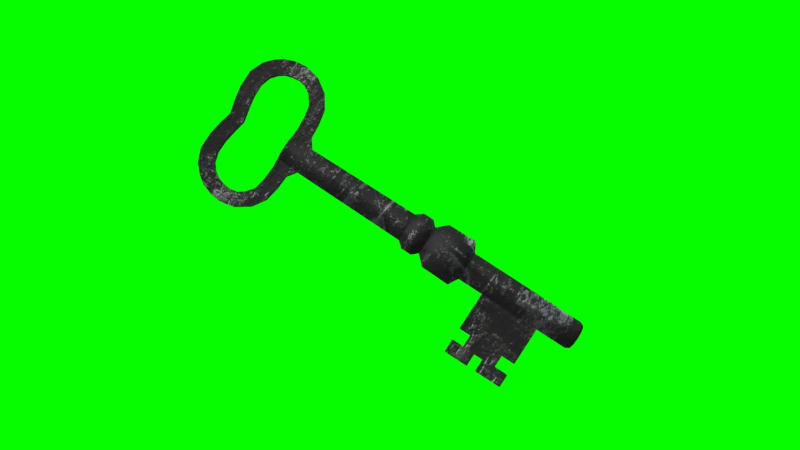
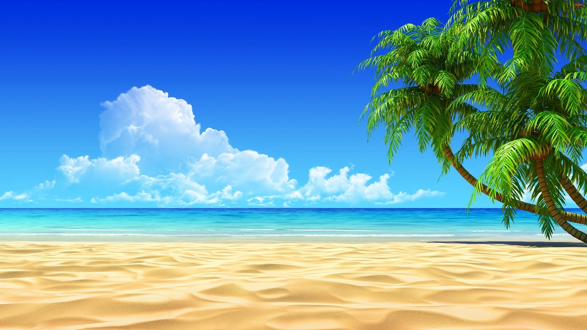
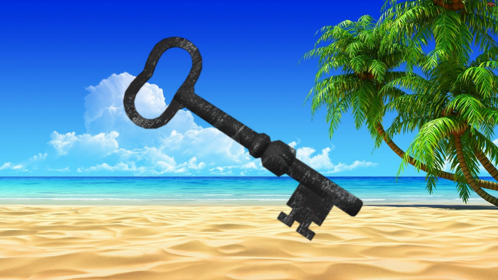

# Blue Matting and Compositing

This repository implements the [Blue Screen Matting](http://alvyray.com/Papers/CG/blusig96.pdf) technique which aims to extract a foreground object out of an image with blue screen in the background then place that foreground object onto a new background. The Solution 1 and the First Vlahos Form mentioned in the paper are used in this implementation. This algorithm is then applied to videos with blue/green screen. ***A Jupyter Notebook is provided for demonstration.***

Perfect green screen

  
  
  

Imperfect green screen

  
  
  

## Disclaimer
**This software is published for academic and non-commercial use only.**

## Acknowledgement

* This work was done by Vien Bui at *the University of Alabama at Birmingam*.

* This [MATLAB implementation](https://github.com/Izzy88/VFX---Matting---ChromaKey) of the First Vlahos Form helped a lot in understanding the algorithm.

* The test data is downloaded from this YouTube [video](https://www.youtube.com/watch?v=U7WYl8pUJW8)

## Contact
Feel free to contact me if there is any question (Vien Bui bnvien@gmail.com).
